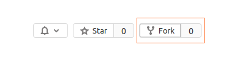

# Final Project - Web

Begin by forking this repository into your lab exercises namespace by clicking the ```fork``` button.



Select your lab exercises namespace as the fork destination on the resulting window.

Once forked, clone the repository to your computer by following the instructions for your editor.

This is an individual assignment, and must be completed without assistance from other students, external persons, or online solution providers. You are welcome to use static online resources without other limitations.

Your completed code must be pushed to Gitlab at a time agreed apon with your lecturer, between 2024-02-09 and 2024-02-14. Submissions delivered after this period will not be considered due to grade submission deadlines.

# Overview

In this project you will develop a blogging website using the skills you have learnt through the _Programming with Web Technology_ course. The project will also give you the opportunity to show how you can use online resources to discover and apply content not taught within the course.

Through the website, users can register for an account, which is needed to be able to post articles and to leave comments on others. When logged in, they have full control of the content they have authored: creating, updating and deleting their content and comments.

In this document you are given a list of requirements for the blogging system. You will also have the opportunity to customise aspects of the project, within the broader requirements.

The project will give you the opportunity to work on a larger-scale project than you've had experience with previously in the course. It will also allow you to showcase your individual software development skills.


## Marking Criteria

This project is worth 20% of your final grade for the _Programming with Web Technology_ course. The project grade is weighted based on the following categories.


| Category                             | Grade |
|--------------------------------------|-------|
| Web interface feature implementation | 50%   |
| Design Pattern usage                 | 10%   |
| Code quality                         | 20%   |
| Daily Meetings                       | 10%   |
| Version control usage                | 10%   |


### Web interface feature implementation (50%)

In the **Web Interface Requirements** section below, a list of features for the web interface are shown. This grade will be determined by the overall completion of required features, and the functionality of each of these features.


### Design Pattern usage (10%)

Your code should demonstrate appropriate usage of design patterns where applicable.


### Code Quality (20%)

Your code must be easily understandable by third parties, and conform to best practices. This includes the use of appropriate variable and identifier names, sufficient commenting, and breaking your code up into appropriate modules, amongst other considerations. It should be written in a way that would make it easy for other people to understand and modify.

You should use code organisation and quality techniques covered in the course content where possible and appropriate. This would include use of modular routing, design patterns, refactoring, and testing where possible. Consider carefully how you can structure things like DAOs, CSS, Handlebars, and JavaScript files so that you can effectively share and reuse code.

The project is designed to provide an opportunity to apply the technologies and concepts taught in COMPX569. It is expected that you will use the general approaches and principles taught in COMPX569 to approach the implementation. While you may integrate some code from other sources for specific components like the WYSIWYG you should not use any premade templates or frameworks for larger parts of the project. If you have doubts about what tools are appropriate to use, ask your lecturer.


### Daily meetings (10%)

Each working weekday during the project, Monday-Thursday you are required to briefly meet in-person or via a voice chat with your lecturer to report progress, and to discuss any issues you have encountered that may require assistance. These meeting may also serve as an opportunity to get feedback on design decisions you have made.

Grades are allocated based on attendance for these meetings, with full marks obtained by attending on each required day.


### Version control usage (10%)

When working on large projects, use of version control is very important to ensure that work can be undone and recovered to restore functionality in the event that errors were made in development. Usage of git is expected, and regular committing with relevant commit messages will be evaluated. Grade will be determined through evaluation of the project commit log. It is expected that there will be a single commit per day (averaged over the duration of the project) at an **absolute minimum**.


## Web Interface Requirements

To form the core functionality of this application, the following requirements need to be met.


### General

1. Database connection details should be stored in an external configuration or `.env` file, and should not be included in the repository. Ensure a `.env.sample` file is present to indicate what values need to be supplied.

2. Make use of prepared statements when dealing with user-provided data,


### User accounts

1. Users must be able to create new accounts. Each new user should be able to choose a username (which must be unique) and a password. At minimum, a user's real name and date of birth should also be recorded, along with a brief description about themselves.

2. When selecting a username while creating an account, users should be immediately informed if the given username is already taken. Users should not have to submit a form to discover whether their chosen username is taken - you will have to investigate how to use AJAX/Fetch for this.

3. When selecting a password while creating an account, users should be presented with two password textboxes (e.g. "Choose password", and "re-enter password"). They must type the same password in each box in order to proceed. If the user didn't enter the same password in both textboxes, they should not be allowed to submit the form. Ideally, a visual notification message, such as ("passwords do not match"), should also be displayed.

4. Users' passwords should not be stored in plaintext - they should be appropriately hashed and salted. You will need to research hashing and salting; we can provide some materials that will help with this if required.

5. When creating an account, users must be able to choose from amongst a set of predefined "avatar" icons to represent themselves.

6. Once a user has created an account, they must be able to log in and log out.

7. Users must be able to edit any of their account information (including their username), and also be able to delete their account. If a user deletes their account, all of their articles and comments (see below) should also be deleted.


### Articles

1. Users must be able to browse a list of all articles, regardless of whether they are logged in or not. If logged in, they should additionally be able to browse a list of their own articles.

2. When viewing the lists of articles identified above, users should be able to sort article lists by article title, username, and date (but only one at a time). Users should be able to sort articles without the browser window having to reload. Aim to follow UI/UX conventions for user friendly sorting functionality. You may want to investigate how it has been implemented in similar interfaces. It is expected that the usability of your sorting options is intuitive and shows good interface design.

3. When logged in, users must be able to add new articles, and edit or delete existing articles which they have authored.

4. When logged in, users must be able to like articles. An individual user should only be able to like the same article once. Once a user has liked an article, they should be able to see that they have already liked that article. The total number of likes from all users should be displayed somewhere so users can see how many likes each article has.

5. When creating or editing articles, users should be presented with a WYSIWYG (what you see is what you get) editor. The WYSIWYG editor should allow users to edit the formatting of an article without having to edit the HTML markup. There are a variety of styles of WYSIWYG editors and you may code your own from scratch or integrate an existing WYSIWYG library; there are a variety available online but you should research the range of options available. Investigate WYSIWYG options carefully as it is better to do a more robust implementation of a simple editor that fits with the style of your site and how articles should display than integrating a WYSIWYG editor that will allow a user to create content that will break your site or display incorrectly. The editor should (at minimum) allow users to:
   + Add headings (or titles and subtitles)
   + Make text bold, italic and underline
   + Add bulleted and numbered lists

6. When creating new articles, users must be able to add an image to that article (if they choose - whether a user adds an image is up to them). When editing articles, users must be able to change, add, or remove this image. It is not compulsory to design it so users can add more than one image or add images inline with text. Implementing file uploads for multiple images can add complexity, so it is suggested that you consider the implementation of image uploads carefully so that uploaded images of varying sizes will display appropriately; you may even want to consider having some form of resizing or validation to ensure images display well.


### Comments

1. When logged in, users must be able to comment on articles. When viewing articles, comments associated with that article should also be viewable.

2. Comments must show the username of the commenter, and the timer & date the comment was made, in addition to the comment itself.

3. Commenters should be able to delete their own comments; article authors should be able to delete any comments on their own articles.

4. Users should be able to comment on comments up to at least two levels of nesting (i.e. comments on comments on comments). Any comment should be able to be replied to up to two levels of nesting. Comments should be listed chronologically below the article or comment they are replying to. Comments that are replies to comments should be indented and directly below the comment they are in reply to. An example of what two levels of nesting would look like is included below.
   + comment...
   + comment...
     + comment...
     + comment...
       + comment...
       + comment...
     + comment...
   + comment...
     + comment...
     + comment...

5. Users should be able to show or hide comments for articles they're reading.


### Usability

1. The website must have a consistent look and feel, and must be responsive. The interface should respond well to the resizing of the screen and be usable throughout the range of common screen-widths. Consider how you can have a structured and systematic approach to creating CSS.

2. The website must be user friendly and have good usability. When adding the features, consider how such features have been implemented in other websites you've used before. What did you like about those websites? What could use improvement? It is suggested you investigate usability and review resources such as Neilsen's heuristics and / or PACMAD.

3. It is suggested that you have a structured approach to interface design and consider creating "wireframe" outlines of your pages so you can plan what elements need to be on each page and how they are positioned. You may wish to create hand-drawn wireframe designs or investigate using a tool like Figma.


# Deliverables & Project Submission


## Source Code

Your git repository will serve as the submission for your project source code. Ensure that your repository master branch is up-to-date on or before the due date given at the top of this document. Any commits after this deadline will be ignored by the markers.

Ensure that the provided [`db-init.sql`](./db-init.sql) file contains the necessary SQL statements to recreate and initialise your database manually if required.

If any special setup instructions are required, please document these in the provided [`SETUP.md`](./SETUP.md) file.
